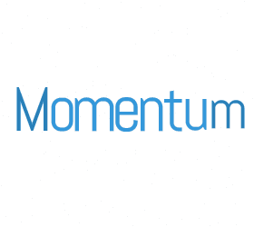
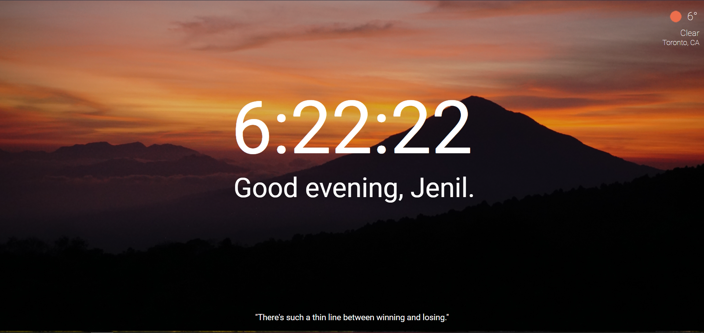

<!-- PROJECT LOGO -->
 

  
  <h3 align="center">Momentum Clone Project</h3>

<!-- ABOUT THE PROJECT -->
## About The Project

Personal Dashboard with Digital Clock, Welcome Message, Daily Weather and Inspirational Quote of the Day

### Built With

This project was built using React along with Weather API, Quote API, Unsplash API
* HTML/CSS/JS
* [OpenWeatherMap](https://openweathermap.org/)
* [Quotes API](https://quotes.rest/)
* [Unsplash API](https://unsplash.com/developers)

<!-- GETTING STARTED -->
## Getting Started

- Clone this repo
- `npm install` to install all req'd dependencies
- `npm start` to start the local server (this project uses create-react-app)

### Prerequisites

- Install these dependencies
  - `npm install axios` to install the HTTP library
  - `npm install react-icons` to install the react icons

- Open Weather Map API Key
  - Get a free API Key at [OpenWeatherMap](https://openweathermap.org/)
  - Insert your API key in the .envTemp file
- Unsplash API
  - Get a free API Key at [Unsplash API](https://unsplash.com/developers)
  - Insert your API key in the .envTemp file
- **Change Environmental Variable File**
  - Follow the instruction in the .envTemp file

<!-- CONTACT -->
## Contact
Jenil Vekaria - [@github](https://github.com/Jenil-Vekaria)

<!-- ACKNOWLEDGEMENTS -->
## Acknowledgements
* [Google Chrome Extension: Momentum](https://chrome.google.com/webstore/detail/momentum/laookkfknpbbblfpciffpaejjkokdgca?hl=en)
